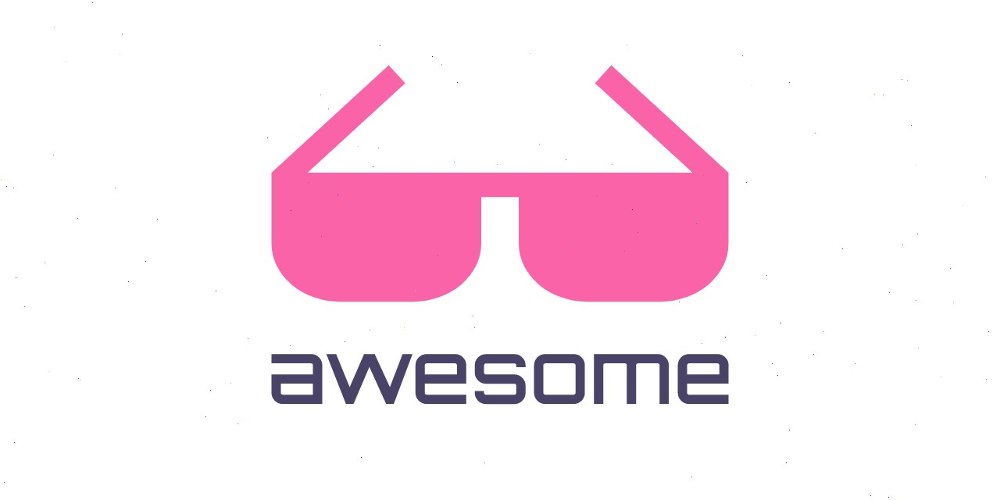

**Polymarket is a decentralized information markets platform where users can trade on the outcome of future events. This list compiles the best tools and resources for traders, developers, and researchers.**

## Contents

- [Official Resources](#official-resources)
- [Trading Bots & Automation](#trading-bots--automation)
- [API Libraries & SDKs](#api-libraries--sdks)
- [Telegram Bots](#telegram-bots)
- [Data APIs & Aggregators](#data-apis--aggregators)

## Official Resources

- [Polymarket](https://polymarket.com/) - Official platform
- [Polymarket Documentation](https://docs.polymarket.com/) - Developer documentation and API references
- [Polymarket Blog](https://polymarket.com/blog) - Official announcements and insights
- [Polymarket GitHub](https://github.com/Polymarket) - Official repositories

## Trading Bots & Automation

### Official & Featured

- [Polymarket Agents](https://github.com/Polymarket/agents) - Official AI agents framework with LLM integration, autonomous trading capabilities, and modular architecture
- [poly-market-maker](https://github.com/Polymarket/poly-market-maker) - Official CLOB market maker with bands or AMM strategy and Docker support
- [polymarket-app](https://github.com/polymarket-us-app/polymarket-app) - Polymarket App is a professional desktop terminal for the world’s largest prediction market.

### Market Making Bots

- [poly-maker](https://github.com/dev-0x7C6/poly-maker) - Automated market making bot with Google Sheets configuration and position merging
- [polymarket-liquidity-rewards-bot](https://github.com/polymarket-liquidity-rewards-bot/polymarket-liquidity-rewards-bot) - Band-based market making bot with automated order management

### Polymarket & Arbitrage Terminal

- [HowtoMakeMoneyonPolymarket](https://github.com/HowtoMakeMoneyonPolymarket/HowtoMakeMoneyonPolymarket) - The #1 non-custodial trading terminal for Polymarket prediction markets. Capture live sports & political arbitrage spreads with zero-latency WebSocket scanning.

### Copy Trading

- [polymarket-copy-trading-bot](https://github.com/username/polymarket-copy-trading-bot) - Automated copy trading with real-time monitoring of top traders
- [polymarket-trade-copier](https://github.com/username/polymarket-trade-copier) - Enterprise-grade trade copier with blockchain event tracking

## Telegram Bots

- [Polycule](https://t.me/polyculebot) - Telegram trading bot with group trading, copy trading, wallet tracking, and mobile-first design
- [PolyFocus](https://t.me/polyfocusbot) - Trading bot with copy trading, multi-chain wallet, market search, and position tracking
- [Polysight](https://t.me/polysightbot) - Real-time market insights bot with fast alerts and actionable summaries
- [PolyxBot](https://t.me/polyxbot) - AI-powered intelligence tool with whale tracking and predictive signals
- [Polycool Bot](https://t.me/polycoolapp_bot) - Copy-trading tool for following winning wallets and profitable whales
- [PolyAlertHub](https://t.me/polyalerthub) - Alert system with whale tracking, volatility monitoring, and multi-channel alerts

## API Libraries & SDKs

### Python

- [polymarket-apis](https://pypi.org/project/polymarket-apis/) - Unified Polymarket APIs with Pydantic models for CLOB, Gamma, Data, Web3, WebSocket, and GraphQL clients
- [py-clob-client](https://pypi.org/project/py-clob-client/) - Official Python client for Polymarket's CLOB with order execution and market data

### JavaScript/TypeScript

#### Official SDKs

- [@polymarket/sdk](https://www.npmjs.com/package/@polymarket/sdk) - Official Polymarket SDK for proxy wallet interactions and trading operations
- [@polymarket/clob-client](https://www.npmjs.com/package/@polymarket/clob-client) - Official CLOB client with order placement, market data, and WebSocket support
- [@polymarket/embeds](https://www.npmjs.com/package/@polymarket/embeds) - Official embeddable web components for Polymarket markets

#### Community Libraries

- [@polybased/sdk](https://www.npmjs.com/package/@polybased/sdk) - Comprehensive TypeScript toolkit with real-time data and WebSocket streams
- [@dicedhq/polymarket](https://jsr.io/@dicedhq/polymarket) - TypeScript client with CLOB and Gamma client support
- [polymarket-data](https://www.npmjs.com/package/polymarket-data) - Community TypeScript client for public data access with type safety

#### Integrations & Plugins

- [@theschein/plugin-polymarket](https://www.npmjs.com/package/@theschein/plugin-polymarket) - ElizaOS agent integration for AI agent trading
- [@goat-sdk/plugin-polymarket](https://www.npmjs.com/package/@goat-sdk/plugin-polymarket) - GOAT SDK plugin for market data and betting

## Data APIs & Aggregators

- [FinFeedAPI - Prediction Markets](https://finfeed.io/api/prediction-markets) - Unified API for Polymarket, Kalshi, Myriad, and Manifold with OHLCV data
- [Polymarket Gamma API](https://gamma-api.polymarket.com/) - Official market metadata and event data API
- [Polymarket CLOB API](https://clob.polymarket.com/) - Official trading API with order book data and execution
- [Bitquery Polymarket GraphQL](https://graphql.bitquery.io/) - Blockchain data and smart contract events for on-chain analytics

### Forums & Discussion

- [r/Polymarket](https://reddit.com/r/polymarket) - Reddit community for discussions and analysis
- [Polymarket Telegram](https://t.me/polymarket) - Official Telegram channel
